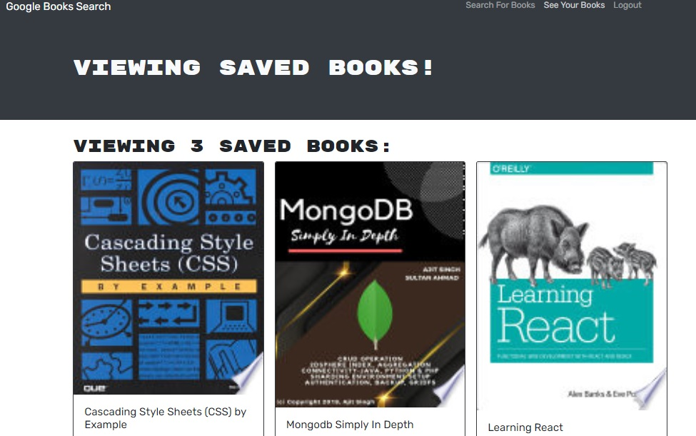

# BOOK SEARCH ENGINE

  

# Description

The application allows you to search for new books to read where user can keep a list of books to buy, user can save these books and delete as much as he wants.The site was refactor to work with GraphQL Api.

 
 _____________________________________________________________________
 Visit the site! [BOOK SEARCH ENGINE](https://)
  

# Table of Contents

[License](#License)

[Technologies](#Technologies)

[Questions](#Questions)

# License
The license for which the application is covered:
NONE 

# Technologies 
 - REACT
- GRAPHQL API
- MONGODB
- NODE.JS
- EXPRESS.JS
- Heroku

# Questions

  If you have questions about the project, below you can find ways to answer them, either by visiting my highub or contacting me by email.
  
  Link to my Github: [anniavd](https://github.com/anniavd)

  
  Email acount: [annia.valded@gmail.com](mailto:annia.valded@gmail.com)
    

